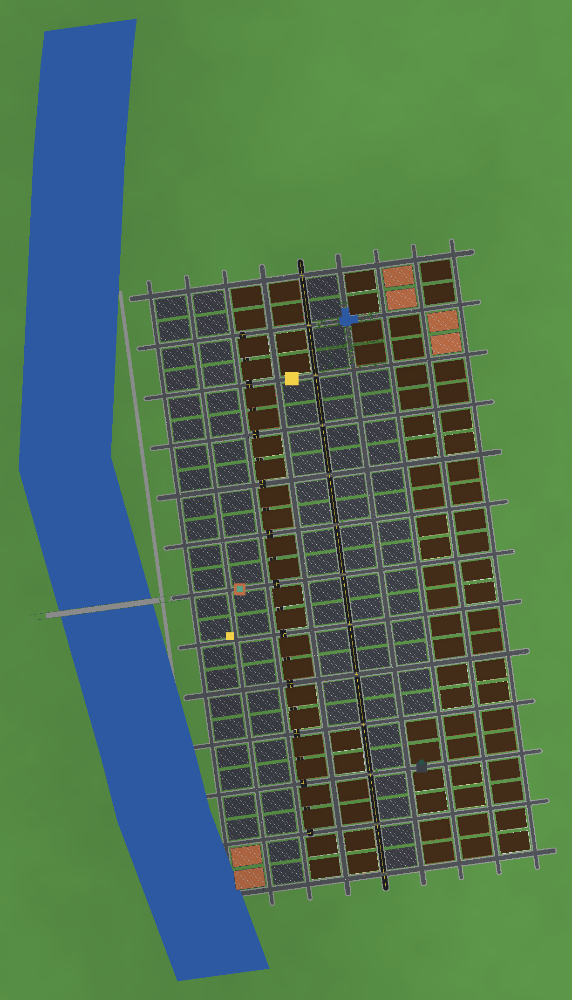

# New Kensington Digital Twin (Minecraft)

A full pipeline that turns the real-world geography of **New Kensington,
Pennsylvania (ZIP 15068)** into a Minecraft **digital twin** — a block-for-block
voxel model of the downtown core that you can paste into any world with
WorldEdit / FAWE.

It is written in **pure Python (standard library only)** — no `pip install`
needed to build the twin — and ships with:

- **Real geography from authoritative data.** The Allegheny River's course, the
  street grid's orientation (~352°), and the city's east-bank offset are all
  derived from the **US Census TIGER/Line ZCTA boundary for ZIP 15068**
  (`newken_twin/data/nk_real_geo.json`). The river you see is the real river.
- **Real river-valley terrain.** The ground is carved from a Chebyshev
  distance-to-river field plus value-noise hills, so the city climbs away from
  the Allegheny the way the real one does.
- **Detailed buildings** with foundations that follow the slope, per-storey
  interior floors, windowed facades, glassy commercial storefronts, doors, and
  two roof systems — flat parapet roofs (with rooftop HVAC) for commercial/civic
  blocks and stepped **hip roofs** (built from a distance transform) for houses.
- **Modelled landmarks**: Mount Saint Peter Church (nave, stained glass, bell
  tower + spire + cross), City Hall (quartz colonnade + copper dome), the
  Tarentum Bridge (truss towers, deck, piers, suspension cables), and a
  veterans' monument.
- **Street life**: sidewalks and curbs around every road, painted centre lines
  on arterials, street lamps, mixed-species street trees, park flowers and a
  pond, and the odd parked car.
- a representative dataset of New Kensington's avenue/street grid, the Allegheny
  River, Constitution Boulevard, Memorial Park and named landmarks, anchored to
  real latitude/longitude;
- a **live OpenStreetMap importer** for an exact-footprint twin when you have
  network access;
- a **WorldEdit-compatible Sponge `.schem`** exporter (full block-state palette
  — stairs, slabs, panes, doors, logs, not just cubes);
- a **top-down PNG map** renderer so you can preview the twin without launching
  the game.



*Top-down preview: the Allegheny River (blue), the rotated avenue/street grid,
Fifth Avenue (the dark spine), the Tarentum Bridge (grey), and varied
rooftops across downtown.*

---

## Quick start

No dependencies required (Python 3.9+):

```bash
# Build the bundled twin -> schematic + preview image
python -m newken_twin build \
    --out build/new_kensington.schem \
    --preview build/new_kensington_preview.png

# Inspect a dataset without building
python -m newken_twin info
```

Then in Minecraft (Java Edition, with WorldEdit or FastAsyncWorldEdit):

```
//schem load new_kensington
//paste
```

### Build an *exact* twin from live OpenStreetMap

When you have internet access, pull real building footprints and the real
street network straight from OpenStreetMap's Overpass API:

```bash
python -m newken_twin build --osm --lat 40.5695 --lon -79.7647 --radius 700
```

If Overpass is unreachable, the tool prints a warning and falls back to the
bundled dataset, so a build always succeeds.

---

## How it works

```
features (bundled JSON or live OSM)
        │   model.py        load + typed feature model
        ▼
   projection             geo.py       lat/lon → local metres → block grid
        ▼
   terrain heightmap      terrain.py   river-valley elevation (distance + noise)
        ▼
   rasterisation          raster.py    scanline polygon fill, thick polylines, disks
        ▼
   voxel volume           volume.py    dense 3D array of palette indices
        │   builder.py     terrain → water/parks → roads+sidewalks → bridges →
        │                  buildings (facades/floors/roofs) → furniture → landmarks
        ▼
   export                 schematic.py  Sponge Schematic v2 (.schem)  +  preview.py  PNG
```

| Module | Responsibility |
| --- | --- |
| `geo.py` | Local equirectangular projection; lat/lon ↔ block coordinates. |
| `terrain.py` | River-valley heightmap (two-pass Chebyshev distance transform + value-noise hills). |
| `model.py` | Feature model (`Building`, `Road`, `Area`, `Point`, `City`) and JSON loader. |
| `raster.py` | 2D rasterisation: polygon fill, thick polylines, disks. |
| `volume.py` | Dense voxel grid in Sponge index order. |
| `blocks.py` | Material → block-id palette and block-state helpers (stairs/slabs/doors/…). |
| `builder.py` | Assembles the layered, terrain-aware voxel city. |
| `schematic.py` | Writes Sponge Schematic v2; varint block data. |
| `nbt.py` | Minimal dependency-free NBT reader/writer. |
| `preview.py` | Hand-rolled PNG encoder for top-down maps. |
| `osm.py` | Live OpenStreetMap (Overpass) importer. |
| `data/` | Bundled `new_kensington.json` dataset + loader. |

### Coordinate convention

One block = one metre by default (`--scale` changes this). `+X` is east, `+Z`
is south, and the north-west corner of the area maps to `(0, 0)` — matching the
Sponge schematic layout `index = x + z·Width + y·Width·Length`.

---

## The dataset

`newken_twin/data/new_kensington.json` is a GeoJSON-style document
(`[lon, lat]` coordinate order) using the same schema the OSM importer emits, so
the two are interchangeable. Regenerate it with:

```bash
python scripts/generate_dataset.py
```

### What's real vs. modelled

| Layer | Source |
| --- | --- |
| Allegheny River course | **Real** — US Census ZCTA 15068 boundary (the river is the ZIP/county line). |
| Grid orientation & east-bank offset | **Real** — derived from the same Census geometry. |
| City extent / coordinates | **Real** — anchored to downtown New Kensington (40.5695, −79.7647). |
| Street grid, building footprints | **Modelled** — a faithful numbered-avenue/street grid; not block-exact OSM footprints. |
| Terrain relief | **Modelled** — valley shape is data-driven (distance to the real river) + noise. |

`newken_twin/data/nk_real_geo.json` holds the extracted real geometry (river
polyline, bearing, offset, area), with attribution to the US Census (public
domain) via the OpenDataDE GeoJSON mirror.

> **Block-exact footprints.** Live OpenStreetMap (and most GIS hosts) are not
> reachable from the build sandbox, so individual building footprints are
> modelled rather than traced. For a block-exact reproduction of every real
> building, run with `--osm` on a networked machine (or feed a real OSM/GeoJSON
> export via `--dataset`) — the importer emits the same schema this dataset uses.

---

## Customising the look

`newken_twin/blocks.py` maps **material groups** (e.g. `road`, `wall_brick`,
`roof_civic`, `water`) to concrete Minecraft block IDs. Edit one table to
re-skin the whole city. `builder.py` controls heights, setbacks, window
banding, bridge piers and landmark beacons.

---

## Tests

```bash
python -m unittest discover -s tests -v
```

The suite covers the projection maths, rasterisation, the NBT round-trip, the
varint encoder, schematic structure, the bundled dataset, a full end-to-end
build and the PNG encoder.

---

## CLI reference

```
python -m newken_twin build [options]
  --dataset PATH        use a custom GeoJSON-style dataset
  --osm                 fetch live OpenStreetMap data (needs network)
  --lat / --lon         centre for --osm (default: downtown New Kensington)
  --radius M            half-extent in metres for --osm (default 650)
  --out PATH            output .schem (default build/new_kensington.schem)
  --preview PATH        output PNG ('' to skip)
  --preview-scale N     integer upscaling for the preview
  --scale M             metres per block (>1 shrinks the model)
  --data-version N      Minecraft DataVersion to embed (default 3465 = 1.20.1)

python -m newken_twin info [--dataset PATH | --osm ...]
```

## License

MIT — see [LICENSE](LICENSE).
